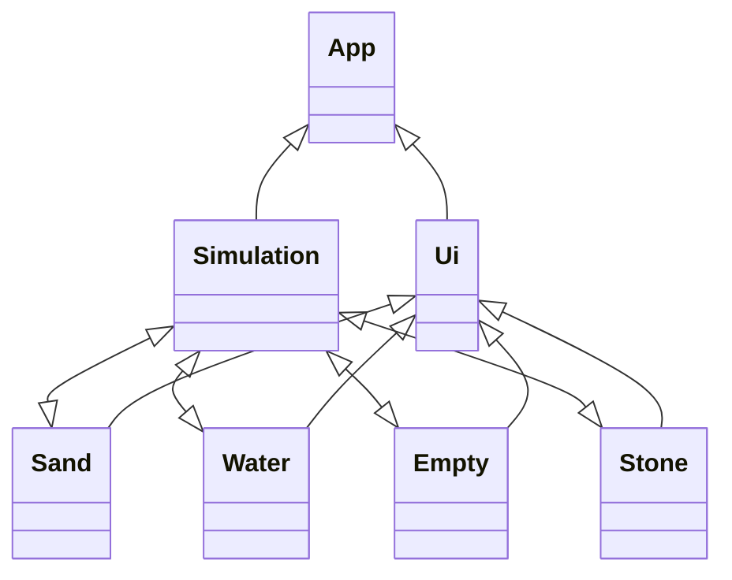

```mermaid
classDiagram
    class App
    class Sand
    class Empty
    class Water
    class Stone
    class Simulation
    class Ui
    App <|-- Simulation
    App <|-- Ui
    Simulation <|--|> Sand
    Simulation <|--|> Water
    Simulation <|--|> Empty
    Simulation <|--|> Stone
    Ui <|-- Sand
    Ui <|-- Water
    Ui <|-- Empty
    Ui <|-- Stone
```