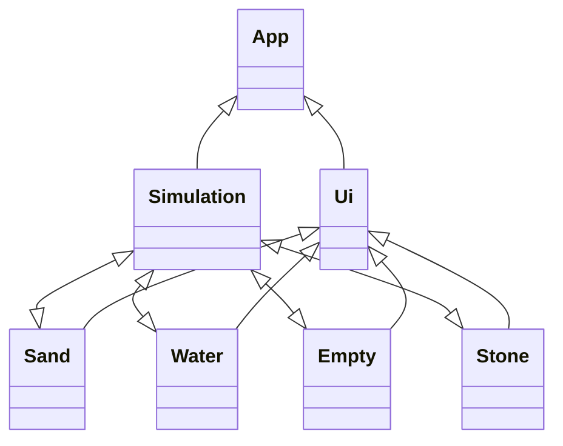
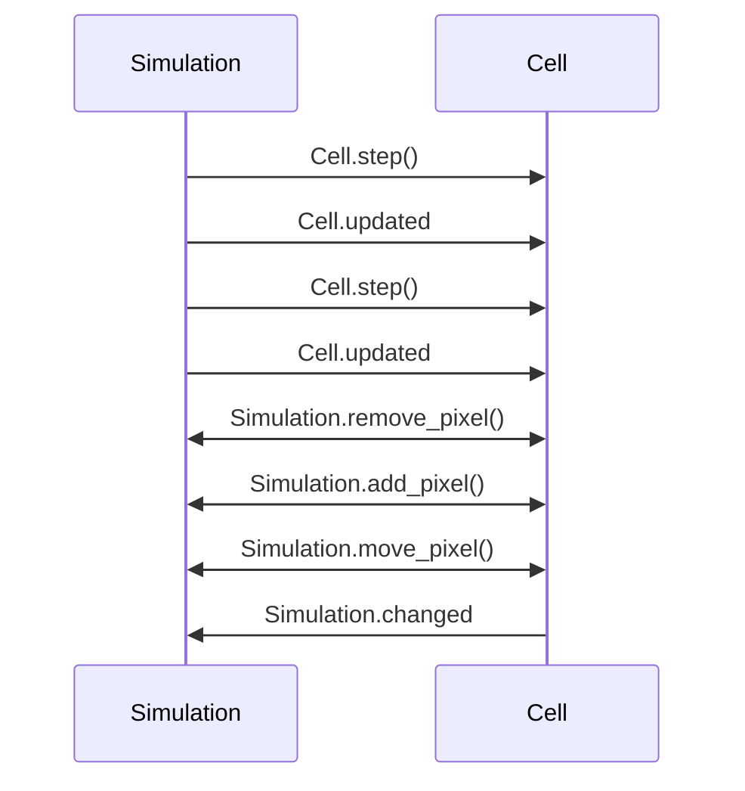

```mermaid
classDiagram
    class App
    class Sand
    class Empty
    class Water
    class Stone
    class Simulation
    class Ui
    App <|-- Simulation
    App <|-- Ui
    Simulation <|--|> Sand
    Simulation <|--|> Water
    Simulation <|--|> Empty
    Simulation <|--|> Stone
    Ui <|-- Sand
    Ui <|-- Water
    Ui <|-- Empty
    Ui <|-- Stone
```

```mermaid
sequenceDiagram
    Simulation->>Cell: Cell.step()
    Simulation->>Cell: Cell.updated
    Simulation->>Cell: Cell.step()
    Simulation->>Cell: Cell.updated
    Cell<<->>Simulation: Simulation.remove_pixel()
    Cell<<->>Simulation: Simulation.add_pixel()
    Cell<<->>Simulation: Simulation.move_pixel()
    Cell->>Simulation: Simulation.changed
```