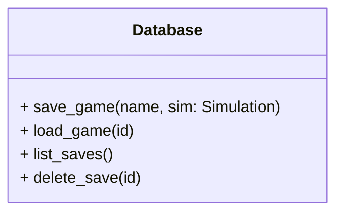
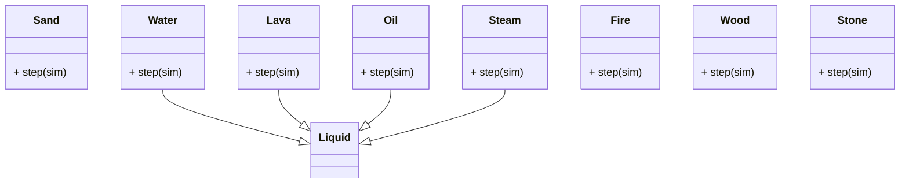
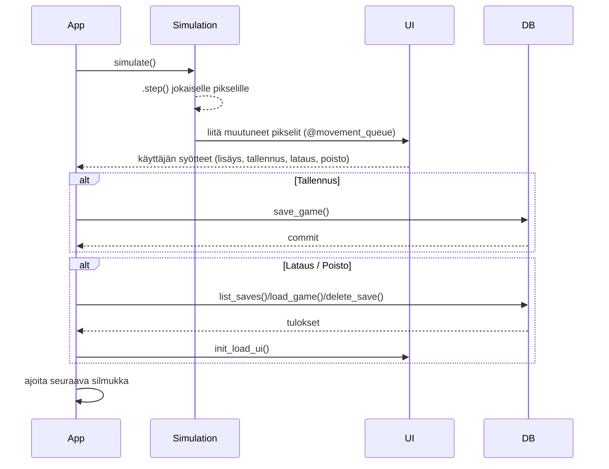

# Arkkitehtuuri

## Tiedostot ja kansiot

```plaintext
├── app.py              # Sovelluksen pääsilmukka ja aloituskohta
├── ui.py               # Tkinter-käyttöliittymä
├── simulation.py       # Simulaation ydin
├── database.py         # Tietokanta 
└── pixels/             # Kaikkien pikselityyppien määritelmät ja niihin liittyvät funktiot
    ├── empty.py        # Tyhjä pikseli
    ├── sand.py         # Hiekka pikseli
    ├── water.py        # Vesi pikseli
    ├── lava.py         # Laava pikseli
    ├── oil.py          # Öljy pikseli
    ├── steam.py        # Öljy pikseli
    ├── fire.py         # Tuli pikseli
    ├── wood.py         # Puu pikseli
    ├── stone.py        # Kivi pikseli
    ├── shared.py       # Apu funktiot
    └── liquid.py       # Nestemäisten pikselien logiikka
```

---
## Käyttöliittymä (ui.py)

Moduuli sisältää:  

- `Ui`-luokan, joka luo Tkinter-ikkunan ja näyttää pelin `PhotoImage`-oliona.  
- Tyyppivalinta-, tallennus- ja latauspainikkeet.
- Painikkeet simulaatioasetusten säätöön ja tallennettujen pelien hallintaan.

Käyttöliittymä kutsuu `App`-luokan metodiketoja käyttäjän toimiessa ja päivittää näkymän `movement_queue`-jonon perusteella.

---
## Simulaatio (simulation.py)

- **Grid**: Lista (`grid[x][y]`) joka sisältää pikseli-olioita.
- **movement_queue**: Jonotus muuttuneille pikseleille käyttöliittymän päivitystä varten.

**Simulaation kulku:**
1. Nollataan `updated`-liput.
2. Kutsutaan jokaisen pikselin `step(simulation)`-metodia.
3. Mikäli `step` palauttaa `True`, lisätään pikseli `movement_queue`-jonoon.

---
## Tietokanta (database.py)

- SQLite-tietokanta yhdistetään tiedostoihin `saves.db`.  
- Käyttäjä voi **tallentaa**, **ladata**, **listata** ja **poistaa** pelisessioita.
- Pelin tila muunnetaan JSON-muotoon, joka tallenetaan tietokantaan.



---
## Pikselit (pixels/)

Jokainen tiedosto `pixels/*.py` määrittelee luokan, jolla on ainakin:

- `type_id`: tunniste.
- `color`: piirtoväri.
- `step(simulation)`-metodi: käyttäytymislogiikka (putoaminen, nouseminen, leviäminen, reaktiot).
- `move_self(x,y)`-metodi: koordinaattien päivitys.



---
## Kaavio ohjelman silmukan kierroksesta


