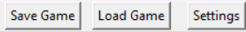

# Käyttöohje

## Lataaminen
---
Uusimman version voit ladata suoraan painamalla pääsivulta Code->Download Zip, tai valita [julkaisun](https://github.com/hfhenri/ot-harjoitustyo/releases)
---
## Asentaminen ja käynnistäminen
---
Asenna riippuvuudet komennolla:

```bash
poetry install
```

Käynnistä komennolla

```bash
poetry run invoke start
```
---
## Pelin toiminnot

Pelillä on hyvin yksinkertainen idea. Näyttöä klikaamalla asetat valitsemasi pikselin.


Käyttöliittymän yläkohdasta voi valita pikselin tyypin:


Oikealla on eri toimintoja pelin säätämiseen:



Save-näppäimestä voit tallentaa pelin tietokantaan:


Load-näppäimestä voit ladata pelin tietokannasta sekä poistaa pelejä:


Settings-näppäimestä voit säätää simulaation nopeutta sekä ruudun kokoa:


