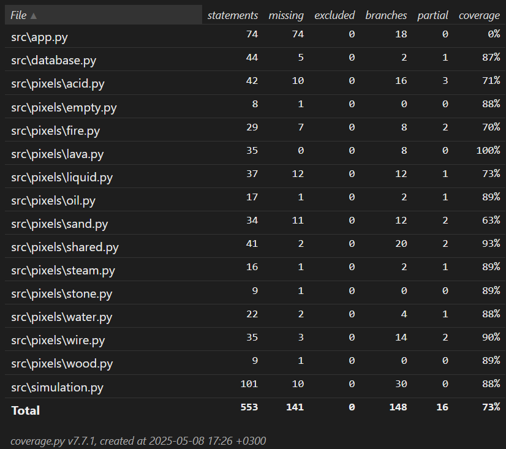

## Testaus

Sovelluksen osia testataan unittesteillä sekä integraationtesteillä.

## Logiikka

Sovelluksen päälogiikkaa testataan erillisissä tiedostoissa:

### Simulaatio

Koska pikselit ja simulaatio toimivat yhdessä, simulaatiota testataan jokaisen pikselin testeissä.

Simulaatiota testataan erikseen luokassa `TestSimulation`-luokan avulla

### Pikselit

Pikseleitä testataan erikseen omissa luokissaan.

Esim. Hiekkaa testataan `TestSand`-luokan avulla ja laavaa `TestLava`-luokan avulla.

Pikseleiden toimintaa keskenään testataan myös esim. `TestAcid`-luokassa.

## Käyttöliittymä

Käyttöliittymää ei testata.

## Testikattavuus

Testikattavuus on noin 73%. 
Kaikkia sovelluksen toimintoja ei testata, mutta kaikki tärkeimmät osat ovat testattuja.

