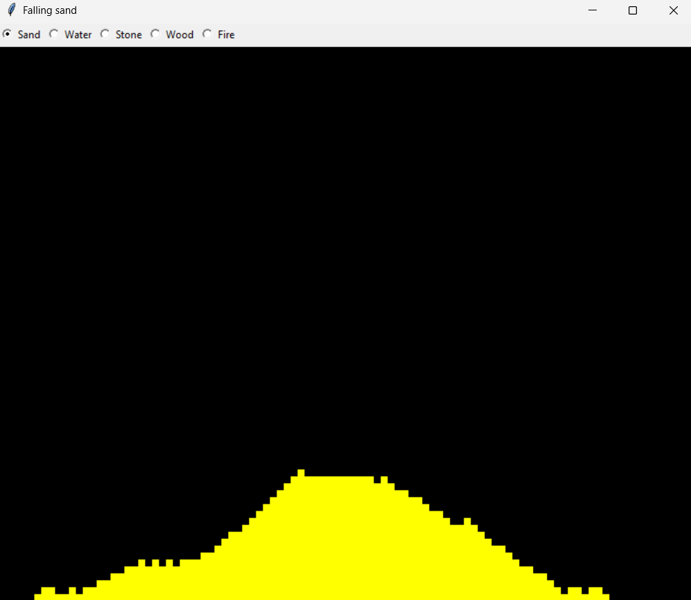

# Vaatimusmäärittely

## Sovelluksen tarkoitus

Sovellus on "Falling sand"-tyyppinen peli/simulaattori, jossa käyttäjä pystyy lisäämään pikseleitä näytölle, jotka käyttäytyvät eri tavoilla riipuen niiden tyypistä.

## Käyttöliittymä

Sovelluksessa tulee olemaan yksi näkymä, josta suurin osa koostuu pelin näkymästä. Käyttöliittymän yläosasta voi valita pikselin tyypin.

Luonnos käyttöliittymästä:

## Suunnitellut toiminnot

- Käyttajä pystyy lisäämän pikseleitä näytölle (Tehty)
- Käyttäjä pystyy valitsemaan pikselin tyypin (Tehty)
- Jokainen pikseli käyttäytyy omien yksinkertaisten sääntöjensä mukaisesti
- Pikselit vaikuttavat toisiinsa niiden tyyppien perusteella
- Yksinkertainen ulkonäkö

