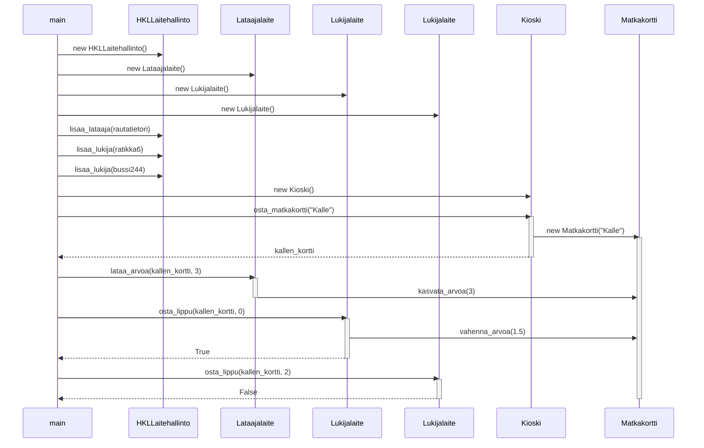

```mermaid
sequenceDiagram
    participant main
    participant laitehallinto as HKLLaitehallinto
    participant rautatietori as Lataajalaite
    participant ratikka6 as Lukijalaite
    participant bussi244 as Lukijalaite
    participant lippu_luukku as Kioski
    participant kallen_kortti as Matkakortti
    main ->> laitehallinto: new HKLLaitehallinto()
    main ->> rautatietori: new Lataajalaite()
    main ->> ratikka6: new Lukijalaite()
    main ->> bussi244: new Lukijalaite()
    main ->> laitehallinto: lisaa_lataaja(rautatietori)
    main ->> laitehallinto: lisaa_lukija(ratikka6)
    main ->> laitehallinto: lisaa_lukija(bussi244)
    main ->> lippu_luukku: new Kioski()
    main ->> lippu_luukku: osta_matkakortti("Kalle")
    activate lippu_luukku
    lippu_luukku ->> kallen_kortti: new Matkakortti("Kalle")
    activate kallen_kortti
    lippu_luukku -->> main: kallen_kortti
    deactivate lippu_luukku

    main ->> rautatietori: lataa_arvoa(kallen_kortti, 3)
    activate rautatietori
    rautatietori ->> kallen_kortti: kasvata_arvoa(3)
    deactivate rautatietori
    main ->> ratikka6: osta_lippu(kallen_kortti, 0)
    activate ratikka6
    ratikka6 ->> kallen_kortti: vahenna_arvoa(1.5)
    ratikka6 -->> main: True
    deactivate ratikka6
    main ->> bussi244: osta_lippu(kallen_kortti, 2)
    activate bussi244
    bussi244 -->> main: False
    deactivate bussi244
    deactivate kallen_kortti
```